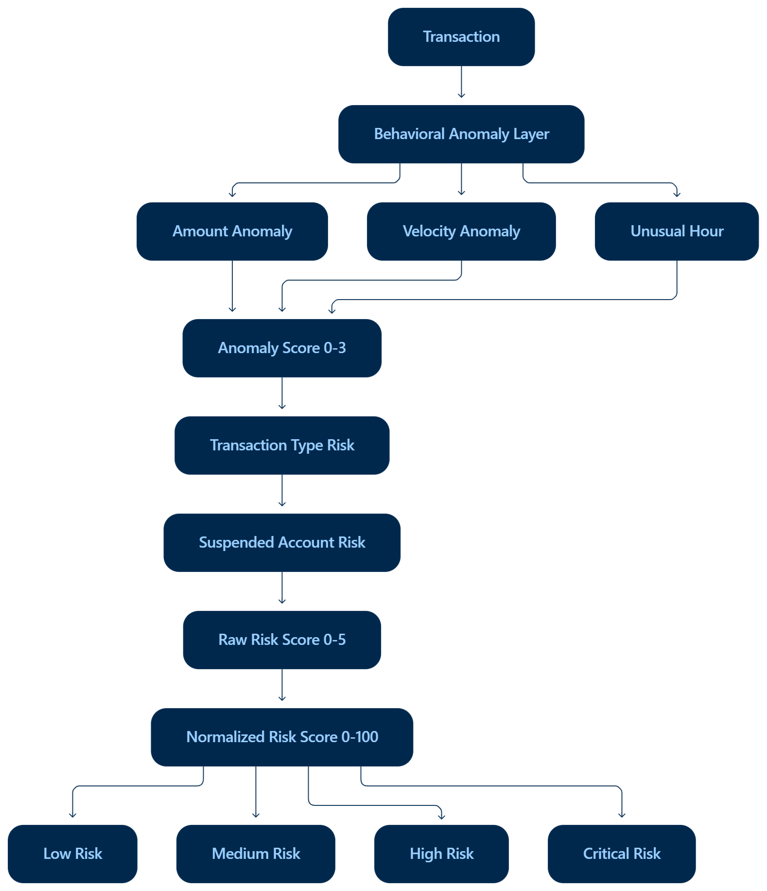
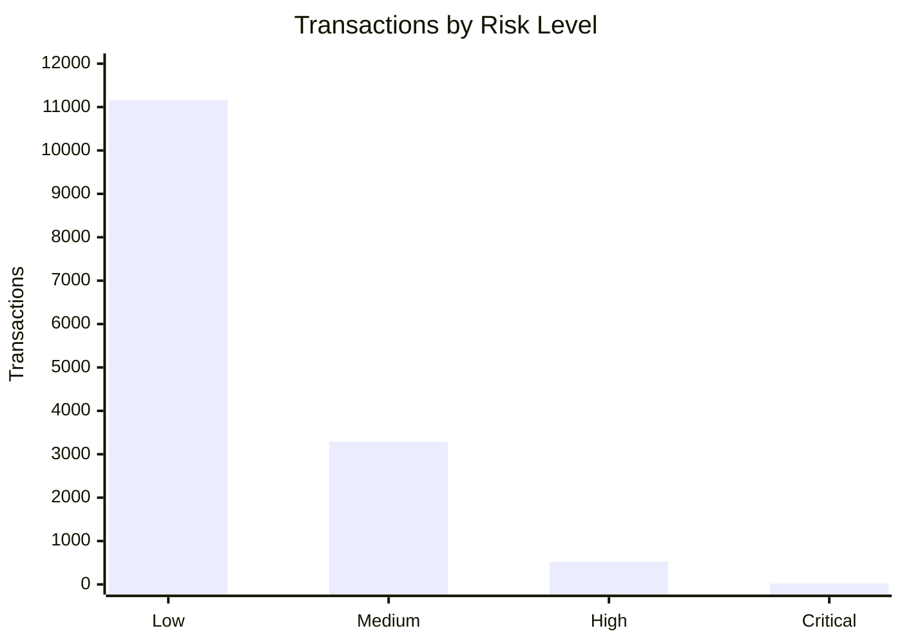
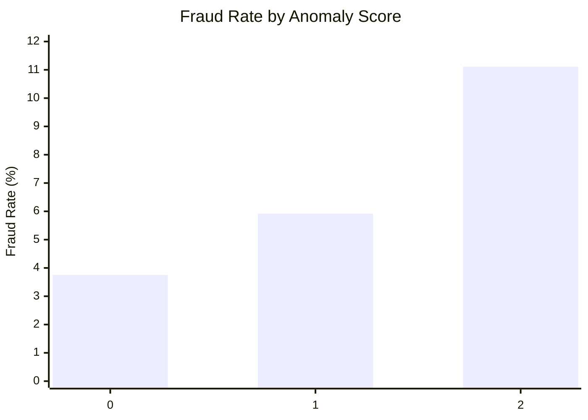

# Key Findings

## 1. Fraud Baseline

The dataset contains **15,000 transactions** with **583 fraudulent transactions**, giving an overall fraud rate of **3.89%**.

| Metric                  |   Value |
| ----------------------- | ------: |
| Transactions            |  15,000 |
| Fraudulent Transactions |     583 |
| Fraud Amount            | ₹13.90M |
| Fraud Rate              |   3.89% |
| Fraud Value Rate        |   7.26% |

Fraud activity increases with transaction volume over time, with **December 2024** recording the highest monthly volume:

* 2,296 transactions
* 93 fraudulent transactions
* 4.05% fraud rate
* ₹1.88M fraud amount

Low-volume early periods were treated cautiously because their percentage-based fraud rates are unstable.

---

## 2. Transaction-Level Findings

### Transaction Type

| Type       | Transactions | Fraudulent | Fraud Rate |
| ---------- | -----------: | ---------: | ---------: |
| Deposit    |          223 |         19 |  **8.52%** |
| Transfer   |        2,869 |        229 |  **7.98%** |
| Purchase   |       10,513 |        296 |      2.82% |
| Withdrawal |        1,395 |         39 |      2.80% |

Deposit and Transfer showed the clearest separation and were therefore retained as a contextual risk signal:

```text
Transfer / Deposit → +1
Purchase / Withdrawal → +0
```

Transaction status showed limited useful separation and was **excluded from direct risk scoring**.

---

## 3. Customer Findings

| Segment        | Customers | Transactions | Fraud Rate |
| -------------- | --------: | -----------: | ---------: |
| High Net Worth |        55 |          851 |      4.94% |
| Affluent       |       264 |        3,974 |      4.05% |
| Mass Market    |       681 |       10,175 |      3.73% |

Customer segment differences are descriptive only and were **not used as direct scoring features**.
### Fraud Rate by Customer Segment


Several customers showed high historical fraud rates, but small transaction counts can produce unstable percentages. Historical `FraudLabel` values were therefore not used in the scoring model.

---

# 4. Behavioral Anomaly Detection

Three customer-specific behavioral signals were retained.

### Amount Anomaly

```text
Amount >= Customer Average + 2 × Customer Standard Deviation
```

This avoids applying the same amount threshold to customers with very different spending patterns.

### Velocity Anomaly

```text
Previous transaction within <= 300 seconds
```

Only **61 transactions (~0.44%)** met this condition, making it a selective signal.

### Unusual Hour

A transaction is unusual when the customer has at least 10 transactions and the transaction hour represents **<5%** of their historical activity.

### Anomaly Validation

| Score | Transactions | Fraud Rate |
| ----: | -----------: | ---------: |
|     0 |       14,062 |      3.75% |
|     1 |          929 |  **5.92%** |
|     2 |            9 | **11.11%** |
|     3 |            0 |          — |

Fraud rate increased as anomaly signals accumulated. The Score 2 result is based on only 9 transactions and should therefore be interpreted cautiously.

---
### Fraud Rate by Anomaly Score


Fraud rate increases from 3.75% for transactions with no detected anomalies
to 5.92% with one anomaly and 11.11% with two anomalies. The score-2 group
contains only 9 transactions, so the result should be interpreted cautiously.

# 5. Feature Selection

Several additional attributes were tested but excluded from direct scoring:

| Signal                | Decision                           |
| --------------------- | ---------------------------------- |
| Merchant RiskLevel    | Excluded — inconsistent separation |
| Location RiskZone     | Excluded — inconsistent separation |
| Device attributes     | Excluded — weak separation         |
| New Location          | Excluded — weak separation         |
| TransactionStatus     | Excluded — limited separation      |
| IsVerified            | Excluded — limited separation      |
| Historical FraudLabel | Excluded — label leakage           |

The objective was **evidence-based feature selection**, not maximizing the number of scoring features.

---

# 6. Explainable Risk Scoring

The final score combines behavioral anomalies with two contextual signals.

```text
Amount Anomaly       +1
Velocity Anomaly     +1
Unusual Hour         +1
Transfer / Deposit   +1
Suspended Account    +1
                     ──
Maximum Score         5
```

```text
RiskScore = RawRiskScore / 5 × 100
```


|  Score | Risk Level |
| -----: | ---------- |
|   0–19 | Low        |
|  20–39 | Medium     |
|  40–59 | High       |
| 60–100 | Critical   |

The **60-point Critical threshold** is intentionally used to isolate the highest-risk combinations.

---

# 7. Risk Validation

| Risk Level | Transactions | Fraud Rate |
| ---------- | -----------: | ---------: |
| Critical   |           20 |      5.00% |
| High       |          525 | **10.10%** |
| Medium     |        3,291 |      6.44% |
| Low        |       11,164 |      2.84% |

High + Critical classifications contain:

**545 / 15,000 = 3.63% of all transactions**

The strongest useful component combination observed was:

```text
Anomaly Score = 1
Transaction Type Risk = 1
Account Status Risk = 0

Fraud Rate = 11.17%
```

compared with the baseline combination:

```text
Anomaly Score = 0
Transaction Type Risk = 0
Account Status Risk = 0

Fraud Rate = 2.84%
```


This supports combining behavioral anomalies with transaction-type context.

---

## Risk Distribution



## Fraud Rate by Anomaly Score



---

# 8. Operational Monitoring

The project provides four monitoring layers:

```text
Transaction Risk
      ↓
Daily Risk Monitoring
      ↓
Merchant Historical Monitoring
      ↓
High-Fraud Merchant Watchlist
```

### Transaction Monitoring

`vw_HighRiskTransactions` provides:

* Risk score and level
* Individual anomaly signals
* Transaction/account context
* Explainable monitoring reason

### Daily Monitoring

`vw_DailyFraudRiskMonitoring` tracks daily:

* Transaction volume
* High/Critical transactions
* High/Critical transaction amount
* Actual fraud transactions
* Actual fraud rate

### Merchant Monitoring

`vw_MerchantFraudMonitoring` provides historical merchant-level fraud metrics.

`vw_HighFraudRateMerchants` identifies merchants with:

```text
Transactions >= 50
AND
Fraud Rate >= 5%
```

This produced **18 merchants** for the historical watchlist.

Merchant `FraudLabel` values are used only for retrospective monitoring and validation, not for transaction-level scoring.

---

# 9. Data Leakage Prevention

`FraudLabel` is the observed outcome and is **never used to calculate**:

* AnomalyScore
* RiskScore
* RiskLevel
* TransactionTypeRisk
* AccountStatusRisk

It is used only for **post-hoc validation and monitoring**.

This keeps the scoring framework independent from the target variable used to evaluate it.

---

# 10. Key Takeaways

1. **Fraud rate:** 3.89% across 15,000 transactions.
2. **Transaction type:** Deposit and Transfer showed the strongest contextual separation.
3. **Behavioral anomalies:** Fraud rate increased from 3.75% with no anomalies to 5.92% with one anomaly.
4. **Risk scoring:** High/Critical classifications cover only **3.63%** of transactions.
5. **Explainability:** The final model uses five simple, auditable risk points rather than a large feature set.
6. **Monitoring:** The pipeline extends from transaction-level scoring to daily and merchant-level monitoring.
7. **Leakage prevention:** Fraud labels are reserved for evaluation, not feature generation.

---

